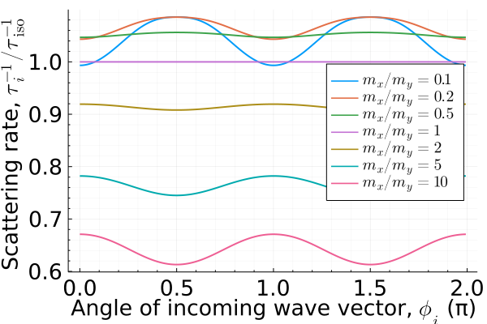
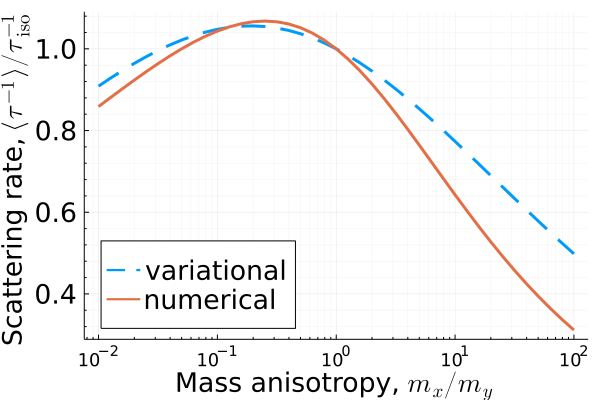

# Boltzmann-Transport in anisotropic 2DEG
This Julia code numerically solves Boltzmann transport equation in 2D for anisotropic parabolic dispersion relation assuming scattering on a charged impurity.
The result is provided in the form of the scattering rate as a function of angle of the incoming wave vector. Additionally, the averaged scattering rate can be
calculated within the variational approach for comparison.
The dispersion relation for anisotropic 2DEG is given by the effective mass model,
```math
\varepsilon_{\bf k} = \frac{\hbar^2 k_x^2}{2m_x} + \frac{\hbar^2 k_y^2}{2m_y}.
```
For electric field applied along the $x$ direction, the Boltzmann transport equation for the relaxation time $\tau_x({\bf k})$ can be written as
```math
v_x({\bf k}) = 2\pi \sum_{{\bf k}'}\delta(\varepsilon_{\bf k}-\varepsilon_{{\bf k}'})\langle |V_{{\bf k}{\bf k}'}|^2 \rangle [v_x({\bf k})\tau_x({\bf k}) - v_x({\bf k}')\tau_x({\bf k}')],
```
where $\langle |V_{{\bf k}{\bf k}'}|^2 \rangle$ is the scattering matrix, and $v_x({\bf k}) = \hbar^{-1} \partial \varepsilon_{\bf k} / \partial k_x$ is the group velocity. 
Assuming scattering on charged impurities, the scattering matrix can be written as
```math
\langle |V_{{\bf k}{\bf k}'}|^2 \rangle = n_{\mathrm{imp}}|\langle \psi_{\bf k}| W | \psi_{{\bf k}'} \rangle|^2,
```
where $W_{\bf q}=v({\bf q})e^{-q\cdot h}/\epsilon({\bf q})$ is the screened Coulomb potential, $h$ is the vertical distance from impurity to the surface, and $v({\bf q})=2\pi e^2/q$ is the 2D Coulomb potential, and $\epsilon({\bf q})=1+v({\bf q})\Pi({\bf q})$. At small $q\leq 2k_\mathrm{F}$, the polarizability of anisotropic 2DEG reduces to its DOS, $\Pi({\bf q})=\sqrt{m_xm_y}/(2\pi \hbar^2)$.
With the given scattering potential and dispersion relation, the integral over the radial components of the wave vector in the Boltzmann transport equation can be taken analytically after the transformation $k_x \rightarrow k_x\sqrt{m_x}$ and $k_y\sqrt{m_y}$. The integral over angles is to be solved numerically. In our case, after discretization with $N$ grid points it is reduced to a system of $N$ linear algebraic equations, which are solved using the methods of linear algebra.

## Results
The results produced by the code are shown in the figures below.




